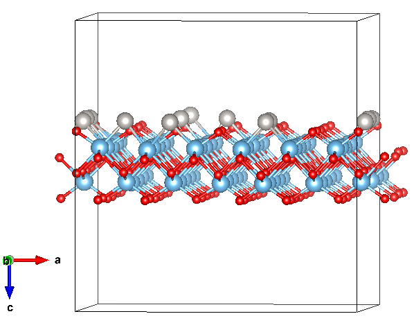

# Doped-TiO2-formation-energy-dataset-ML

This repo is associated with the paper *Data-Efficient Machine Learning for predicting dopant formation energies in TiO2 monolayer*, in which we construct a DFT dataset for doped TiO2 monolayers and examine the machine learning performance in the small-data regime.

Preprint is available in arXiv: xxx 

Manuscript under review (Feb 2026)

## Datasets
The datasets lists Pt-doped (88 data points) and Ag-doped (14 data points) monolayer configurations by labels (Configuration_1, Configuration_2,...). Dopant concentration of each configuration is indicated, and the associated calculated propeties are provided.
The Pt-doped and Ag-doped datasets are available in separate CSV files. Feature descriptions are included here and can also be found in the Supplementary information accompanying the paper.

Example of the supercell of a doped configuration, where the properties are calculated:

## Codes
Jupyter notebooks are provided for feature analysis (including Pearson correlation analysis, SHAP analysis, multicollinearity assessment, and recursive feature elimination step) and for ML predictions (including data preparation, training, predictions, and cross-validation). Separate notebooks are available for Pt-only and Pt+Ag datasets. 

